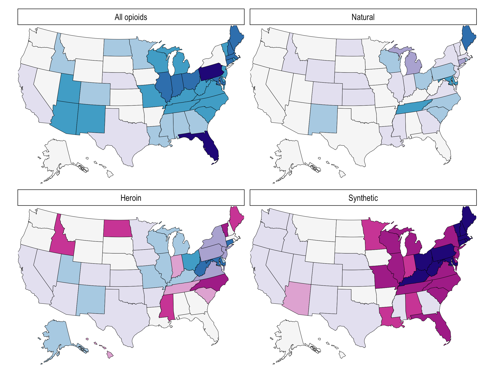
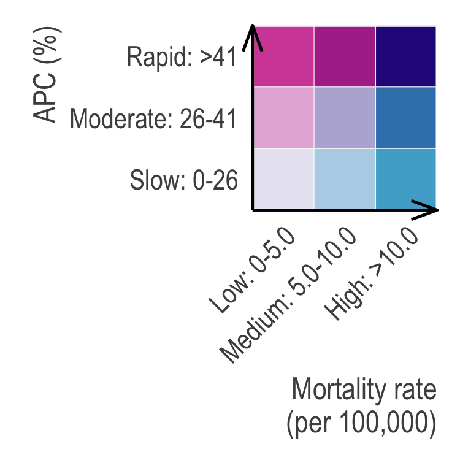

<!-- README.md is generated from README.Rmd. Please edit that file -->

# Assessment of Changes in the Geographical Distribution of Opioid-Related Mortality Across the United States by Opioid Type, 1999-2016

```{r echo=FALSE, out.width = "550px"}

```
```{r echo=FALSE, out.width = "250px"}

```

# Introduction

Code for our *JAMA Network Open* paper ["Assessment of Changes in the Geographical Distribution of Opioid-Related Mortality Across the United States by Opioid Type, 1999-2016"](https://jamanetwork.com/journals/jamanetworkopen/fullarticle/2725487) [[PDF](https://github.com/mkiang/opioid_geographic/blob/master/misc/kiang_basu_chen_alexander-jama_network_open-opioid_geographic.pdf)], which uses [restricted-access multiple cause of death data](https://www.cdc.gov/nchs/nvss/mortality_public_use_data.htm) to examine geographic changes in opioid mortality across space and over time. The full citation is:

> Kiang MV, Basu S, Chen JT, Alexander MJ. Assessment of Changes in the Geographical Distribution of Opioid-Related Mortality Across the United States by Opioid Type, 1999-2016. JAMA Network Open. 2019;2(2):e190040. doi: [10.1001/jamanetworkopen.2019.0040](https://jamanetwork.com/journals/jamanetworkopen/fullarticle/2725487)

## Interactive results explorer 

Disaggregated results are available on the online interactive results viewer located here: [`https://sanjaybasu.shinyapps.io/opioid_geographic/`](https://sanjaybasu.shinyapps.io/opioid_geographic/). You can also use the interactive results viewer offline on your computer by cloning this repo and running `shiny::runApp("./online_results_viewer")` in [RStudio](https://www.rstudio.com/); however, your mileage may vary depending on package versions. 

This viewer not only lets you specify the outcome and location, but also the level of significance (P-values or Q-values), comparison group for life expectancy lost, and other analyses.

## Issues
Please submit issues [via Github](https://github.com/mkiang/opioid_geographic/issues) or via email.

## Important note about reproducibility 
Due to limitations on sharing the restricted-access data, this pipeline is not fully reproducible. When possible, we provide raw data as well as model results. In the cases where observations have fewer than 10 deaths, we suppress the rate as well as the model MSE and SSE, in accordance with the NCHS data use agreement. We provide the suppressed data as examples, but note that the numbers will not be identical unless you are using the private data.

# Elaboration of limitations and assumptions
We thank [Dr. Brian Piper](https://www.geisinger.edu/research/research-and-innovation/find-an-investigator/2018/04/04/13/27/brian-piper) for his careful critique and elaboration of our limitations, specifically in regards to the spatial and temporal assumptions made in the paper. His comments are available on the JAMA Network Open page as well as the [PubPeer review here](https://pubpeer.com/publications/09A1E3EC00D9642A297C51E6EDAEBE). We encourage interested readers and other researchers who use the NCHS data to read his full critique and the references.

# Requirements
## Restricted-access multiple cause of death micro-data

Unfortunately, for years after 2004, the [multiple cause of death](https://www.cdc.gov/nchs/nvss/mortality_public_use_data.htm) data do not include geographic identifiers. Therefore, state-level analysis using the public-access data is not possible. To get restricted data, you must apply through [NAPHSIS](https://www.naphsis.org/). If you have the restricted data, you must specify the file locations as described below.

## Software

All analyses are conducted using `R` (version 3.5.0) and the National Cancer Institute's Joinpoint Regression Program (version 4.6.0.0).

- `R` can be [downloaded via CRAN](https://cran.r-project.org/). 
- The NCI Joinpoint Regression Program can be downlaoded via [their website.](https://surveillance.cancer.gov/joinpoint/)
- In addition, we highly recommend the use of [RStudio](https://www.rstudio.com/products/rstudio/download/) when running `R`.

## `R` Packages
We use the [`packrat`](https://rstudio.github.io/packrat/) package for package management. Once you have cloned this repository, open `opioid_geographic.Rproj` in RStudio and the correct packages (and their correct versions) should be installed automatically. If they are not, details of the packages and correct versions are in the `./session_info.txt` file.

# Analysis pipeline
Different options for the pipeline can be defined in the `config.yml` file, which we described in detail below.

The pipeline is broken into three parts. In part 1, we estimate the age-standardized mortality rates and life expectancy lost in `R`. In part 2, the Joinpoint Regression Program (Windows-only) is used to fit joinpoint models to our mortality rates. Finally, in part 3, the joinpoint results are cleaned and analyzed and plotted (again in `R`).

## Configuation file

The `./config.yml` file contains several global parameters for the analysis pipeline in JSON format. Specifically:

  - `start_year`: Starting year of the restricted-access data
  - `end_year`: Last year of restricted access data
  - `working_data`: Where to save working (i.e., not private, not restricted) data
  - `private_data`: Where to save private (i.e., contains cells < 10 observations) data
  - `zero_rate`: Log-linear models require positive rates. If zero, use this rate. The rate is per capita.
  - `plot_dir`: Where to save plots
  - `proc_in_parallel`: When `true`, perform calculations in parallel.
  - `keep_working_data`: Keep intermediate files?
  - `force_process`: When `true`, overwrite existing files
  - `num_cores`: Number of cores to use (null = 1/2 cores)
  - `sig_p_value`: Define a different threshold for "statistical significance" for the plots.
  - `rate_cuts`: A two-element vector with the bound of the medium mortality bin.
  - `apc_cuts`: A two-element vector with the bounds of the medium APC category.

Typically, a user should not need to change any of these parameters; however, on a computer with sufficient RAM, setting `proc_in_parallel` to `true` should result in significant (linear) speedup. Be warned that this may result in significant RAM usage (~4.2 GB/core) and is not recommended for typical computing environments. Downloading and cleaning the data on a single multicore processor takes somewhere in the order of a few hours.

## Specifying restricted-access data file locations

There are two ways of specifying the file locations in order to fully reproduce our analysis. First, you can place them in a subfolder of this directory named `data_restricted` in the original format and file name that they came in. 

The second way is to simply modify the paths of the file dictionary in `./code/01_process_raw_data.R` (lines 19-38). Each line of the dictionary is a `year:path` key:value pair with the key defined as `yXXXX` where `XXXX` is the year.

## Code files
The analysis pipeline is divided into three parts. 

- **Part 1**: Calculates the age-standardized mortality rates for each opioid type and state as well as the life expectancy lost. In addition, the data are formatted for input into the Joinpoint Regression Program (Part 2). 
- **Part 2**: Performs the joinpoint regression analyses. This part must be done in a separate (Windows-only) program.
- **Part 3**: Synthesizes and plots the joinpoint results from Part 2.

Each part has discrete steps and is described in detail below.

### Part 1: Estimating age-adjusted rates and life expectancy lost

- **Step 1**: `./code/01_process_raw_data.R`: Takes in the raw restricted-access data files and processes them by selecting only the columns we need, cleaning variables, and saving the intermediate (smaller) files.
    - Inputs: Restricted-access MCOD files (18 files)
    - Outputs: `./data_private/proc_XXXX.RDS` (18 files)
- **Step 2**: `./code/02_create_pop_data.R`: Download (if necessary) and create a corresponding data set of population counts for every age group, state, and year of interest.
    - Inputs: None
    - Outputs: 
      - `./data/pop_est_collapsed_long.RDS`
      - Optional: `./data/icen1999.txt.zip`
      - Optional: `./data/icen_2000_09_y0004.zip`
      - Optional: `./data/icen_2000_09_y0509.zip`
      - Optional: `./data/pcen_v2017_y1017.txt.zip`
- **Step 3**: `./code/03_flag_deaths.R`: Cycle through the files processed in `./code/01_process_raw_data.R` and flag all deaths of interest (e.g., heroin, car accidents, firearms, etc.). This dataframe will have year, state, age, and a variety of columns representing the number of deaths for each category under investigation (e.g., opioid deaths).
    - Inputs: `./data_private/proc_XXXX.RDS` (18 files)
    - Outputs: `./data_private/state_opioid_deaths_no_pops.RDS`
- **Step 4**: `./code/04_create_working_df.R`: Combine the population files (from Step 2) and the flagged files (from Step 3) to create a new working dataframe. The resulting files will be (1) the working data set used to calculate life expectancy lost and age-standardized mortality rates and (2) a simple `csv` file containing the information of which cells we need to suppress from the public data.
    - Inputs: 
      -  `./data_private/state_opioid_deaths_no_pops.RDS`
      - `./data/pop_est_collapsed_long.RDS`
    - Outputs: 
      - `./data_private/state_working_data.RDS`
      - `./data/remove_obs.csv`
- **Step 5**: `./code/05_calculate_lel.R`: Using the working data, calculate the life expectancy lost by state, year, and opioid type at various ages. 
    - Inputs: `./data_private/state_working_data.RDS`
    - Outputs: `./data/ex_diff_all_ages_all_areas.RDS`
- **Step 6**: `./code/06_calculate_rates.R`: Using the working data, calculate the age-standardized mortality rates by state, year, and opioid type. In addition, we create a *public* version of the dataset that suppresses cells based on fewer than 10 deaths. 
    - Inputs: 
      -  `./data_private/state_working_data.RDS`
      - `./data/remove_obs.csv`
    - Outputs: 
      - `./data_private/age_std_rates.RDS`
      - `./data/age_std_rates_PUBLIC.RDS`
      - `./data/total_deaths_suppressed.RDS`
- **Step 6**: `./code/07_reshape_for_joinpoint.R`: We convert the age-standardized rates calculated in Step 6 from a wide format to long.
    - Inputs: 
      -  `./data_private/age_std_rates.RDS`
      - `./data/total_deaths_suppressed.RDS`
    - Outputs: 
      - `./joinpoint_analyses/opioids_by_type.csv`
    
### Part 2: Performing joinpoint regressions
- **Step 1**: Run the Joinpoint Regression Program on the `./joinpoint_analyses/opioids_by_type.csv` file generated in Step 6 of Part 1. The Joinpoint Template file (`.jpt`) is included for your reference. We ran joinpoint analyses by state and opioid type. All settings were the default settings with the exception of the number of permutations — we used 9999 vs the default setting of 4499.
- **Step 2**: Save output from Step 1 in the `./joinpoint_analyses/jp_results/` folder. Because some observations must be suppressed according to NCHS rules, we do not include the resulting files except the `opioids_by_type.modelselection.txt` file. You should save all files such that you have the following files:
  - `./joinpoint_analyses/jp_output/opioids_by_type.aapc.txt`
  - `./joinpoint_analyses/jp_output/opioids_by_type.apc.txt`
  - `./joinpoint_analyses/jp_output/opioids_by_type.data.txt`
  - `./joinpoint_analyses/jp_output/opioids_by_type.modelestimates.txt`
  - `./joinpoint_analyses/jp_output/opioids_by_type.modelselection.txt`

### Part 3: Synthesizing results 
- **Step 1**: `./code/08_clean_joinpoint_results.R`: Clean and reshape the results from the joinpoint program into a public version and a private version for use in the interactive online viewer and the table, respectively. In addition, this step calculates the false discovery rate-adjusted P-values (i.e., Q-values). 
    - Inputs: 
      -  `./joinpoint_analyses/jp_output/opioids_by_type.data.txt`
      -  `./joinpoint_analyses/jp_output/opioids_by_type.apc.txt`
      -  `./joinpoint_analyses/jp_output/opioids_by_type.modelestimates.txt`
      -  `./joinpoint_analyses/jp_output/opioids_by_type.aapc.txt`
      - `./data/remove_obs.csv`
    - Outputs: 
      - `./data_private/joinpoint_results_private.RDS`
      - `./data/joinpoint_results_public.RDS`
      - `./online_results_viewer/shiny_data/joinpoint_results_public.RDS`

### Part 4: Plotting results
- **Figure 1**: `./code/09_fig1_current_hotspots.R`: Plots Figure 1 of the paper.
- **Figure 2**: `./code/10_fig2_current_lel15.R`: Plots Figure 2 of the paper.
- **eFigure S1**: `./code/11_figS1_modeled_opioid_rate.R`: Plots eFigure 1 of the paper.
- **eFigure S2**: `./code/12_figS2_aapc_map.R`: Plots eFigure 2 of the paper.

### Others:
- `99_tally_deaths_by_sex.R`: Uses the multiple cause of death data to estimate a few summary statistics found in the paper. Namely, it counts all the deaths (by cause of death) for males and females, separately. In addition, it calculates the mean and standard deviation of age at death.
- `99_fig1_current_hotspots_statebin.R`: Plots a statebin version of Figure 1.
- `99_fig2_current_lel15_statebin.R`: Plots a statebin version of Figure 2.
- `99_figS2_aapc_map_statebin.R` Plots a statebin version of eFigure 2.

# Session Information

Both `sessioninfo::session_info()` and `sessionInfo()` output can be found in the `./session_info.txt` file.

```{r echo=TRUE, message=FALSE, warning=FALSE, eval=FALSE}
sink("./session_info.txt", append = FALSE, split = FALSE)
cat(sprintf("Date/Time of Info: %s\n", Sys.time()))

cat("\n\nsessioninfo::session_info()\n")
sessioninfo::session_info()

cat("\n\n\nsessionInfo()\n")
sessionInfo()
sink()
```


# Authors
- [Monica Alexander](http://monicaalexander.com) (: [mjalexander](https://github.com/mjalexander) | : [\@monjalexander](https://twitter.com/monjalexander))
- [Sanjay Basu](https://sites.google.com/stanford.edu/basulab/home?authuser=0) (: [sanjaybasu](https://github.com/sanjaybasu))
- [Jarvis Chen](http://www.dfhcc.harvard.edu/insider/member-detail/member/jarvis-t-chen-scd/)
- [Mathew Kiang](https://mathewkiang.com) (: [mkiang](https://github.com/mkiang) | : [\@mathewkiang](https://twitter.com/mathewkiang))
